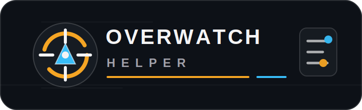

<p align="center">
  
</p>

<h1 align="center">Overwatch Tactical Board</h1>

<p align="center">
  A browser-based tactics board for planning Overwatch comps, rotations, set plays, ult paths, and map control.
</p>

<p align="center">
  
  
  
  
</p>

---

## What It Does

Overwatch Tactical Board turns every supported map into a coach-friendly planning canvas. Pick a map, use the top-down blueprint when Liquipedia has one, drag heroes into position, draw routes and pressure zones, add notes, then save or export the strategy.

It is built for quick iteration during reviews, scrims, ranked stacks, and pre-match prep.

## Highlights

- Full hero roster imported from Liquipedia
- Full map list imported from Liquipedia
- Liquipedia Commons top-down blueprints for supported maps
- Local cached assets for stable rendering and export
- Hero tray with role filters
- Blue/red team tokens with role badges
- Arrows with editable endpoints, width, color, and dashed style
- Zones with editable radius, opacity, and color
- Text notes with editable text, color, and size
- Drag, duplicate, delete, undo, redo
- Touchpad-friendly map navigation
- Snap-to-grid and grid visibility controls
- Save/load strategies in the browser
- Export strategy as PNG or JSON

## Quickstart

```bash
npm install
npm run dev
```

Open:

```txt
http://localhost:3000
```

If port `3000` is busy, Next.js will print the available port in the terminal.

## Controls

| Action | Control |
| --- | --- |
| Pan map | Two-finger touchpad scroll |
| Pan map alternative | Right mouse drag, middle mouse drag, or `Space + drag` |
| Zoom | `Ctrl`/`Cmd`/`Alt` + scroll |
| Delete selected | `Delete` or `Backspace` |
| Duplicate selected | `Ctrl/Cmd + D` |
| Undo | `Ctrl/Cmd + Z` |
| Redo | `Ctrl/Cmd + Y` or `Ctrl/Cmd + Shift + Z` |
| Edit text note | Double click text or use the properties panel |
| Resize zone | Select zone, drag the control handle |
| Edit arrow | Select arrow, drag endpoint handles |

## Pages

```txt
/maps              map grid with mode filters
/heroes            hero grid with role filters
/board/[mapId]     tactical board editor
```

## Data And Assets

The project keeps the app fast and export-safe by caching assets locally after import.

```bash
npm run import:liquipedia
```

That command:

- reads hero and map lists from Liquipedia portal pages
- resolves image files through Liquipedia/Commons API endpoints
- caches hero portraits in `public/assets/liquipedia/heroes`
- caches map images in `public/assets/liquipedia/maps`
- caches top-down blueprints in `public/assets/blueprints/liquipedia` when available
- writes normalized data to `data/heroes.json` and `data/maps.json`

Top-down blueprint fallback behavior:

- if Liquipedia Commons has a `Top Down View` image, the board uses it
- if not, the board falls back to the normal map image

## Scripts

| Command | Description |
| --- | --- |
| `npm run dev` | Start the Next.js dev server |
| `npm run build` | Build for production |
| `npm run start` | Run the production build |
| `npm run lint` | Run ESLint |
| `npm run import:liquipedia` | Import data and cache all supported assets |
| `npm run cache:liquipedia-assets` | Refresh hero/map display assets |
| `npm run cache:blueprints` | Refresh Liquipedia top-down blueprints |

## Architecture

```txt
Next.js App Router
  ├── /maps, /heroes, /board/[mapId]
  ├── React UI components
  ├── Zustand board state
  ├── react-konva tactical canvas
  ├── dnd-kit hero tray drag/drop
  └── localStorage strategy persistence

Data pipeline
  ├── Liquipedia portal wikitext
  ├── Liquipedia Commons imageinfo
  ├── local JSON normalization
  └── public asset cache
```

## Project Structure

```txt
src/
├── app/
│   ├── maps/
│   ├── heroes/
│   └── board/[mapId]/
├── components/
│   ├── TacticalBoard.tsx
│   ├── HeroTray.tsx
│   ├── ToolBar.tsx
│   ├── LayerPanel.tsx
│   └── StrategySidebar.tsx
└── lib/
    ├── board-store.ts
    ├── mock-data.ts
    └── types.ts

data/
├── heroes.json
└── maps.json

scripts/
├── import-liquipedia.mjs
├── cache-liquipedia-assets.mjs
└── cache-liquipedia-blueprints.mjs
```

## Roadmap

- Multi-phase strategy timelines
- Presentation mode
- Shareable strategy links
- PDF export
- Per-map templates
- Team compositions and ult economy notes
- PostgreSQL/Prisma persistence for shared workspaces

## Credits

Hero, map, and top-down source data comes from Liquipedia and Liquipedia Commons. This project is an unofficial planning tool and is not affiliated with Blizzard Entertainment.

Overwatch names, map names, hero names, and related game assets belong to their respective owners.
